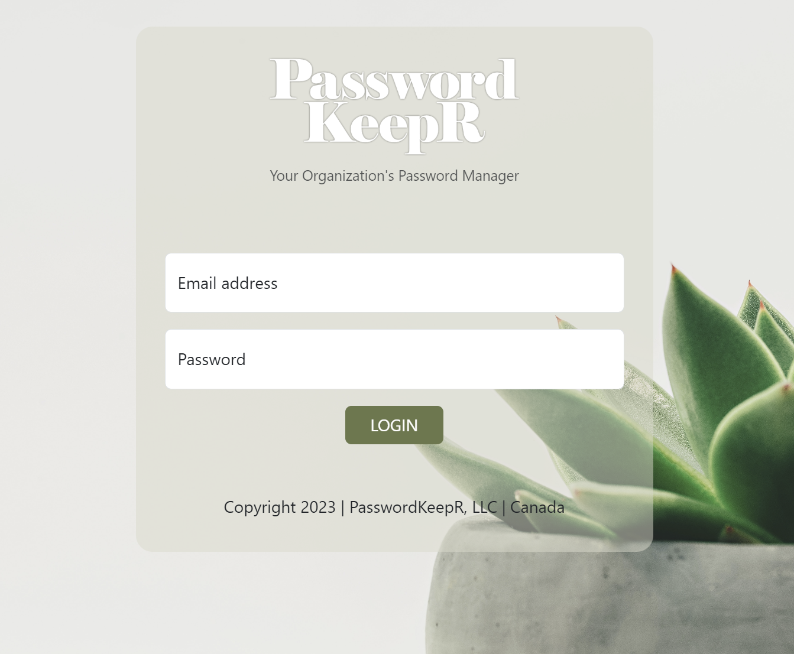
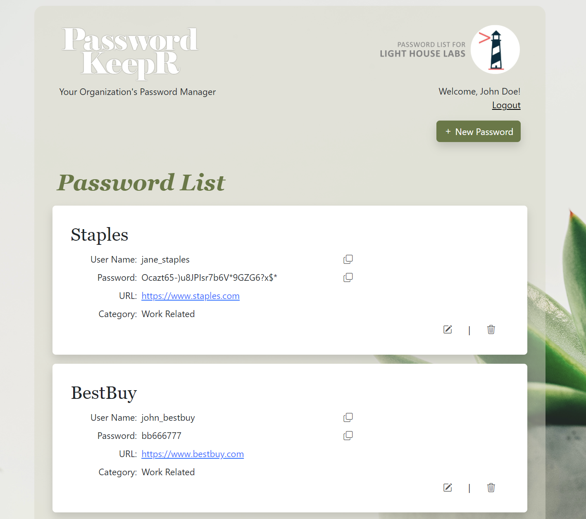
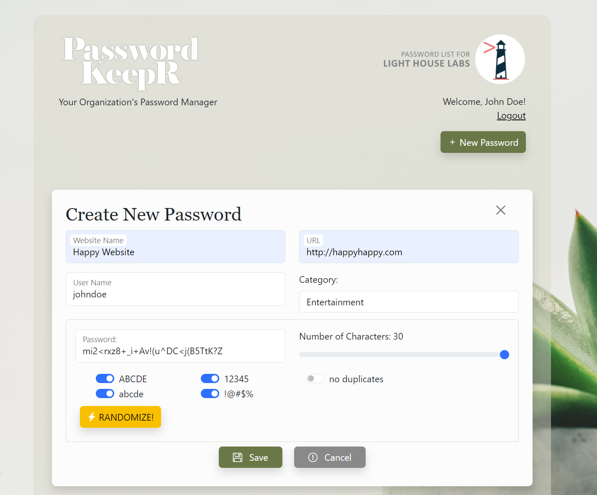

PasswordkeepR
=========

## Project Overview
PasswordkeepR is an organizational password management application designed to securely store and manage passwords for various departments within a company. It ensures that critical business operations can proceed smoothly, even when the primary password holder is unavailable, by allowing authorized employees to access the necessary credentials.

## Description
This tool enhances operational efficiency by reducing downtime and the dependency on single individuals for critical credentials. PasswordkeepR was developed as part of the LHL MidTerm Team Project submission in December 2023.

## LHL MidTerm Team Project submission (December 2023)
- Tejasva Bhatia
- Jonathan Lao

## Screenshots

## Features
- **Secure Password Storage:** Store passwords for various departments in a single application.
- **Role-Based Access Control:** Ensure that only authorized employees can access specific passwords.
- **User-Friendly Interface:** Easily manage and retrieve passwords with an intuitive UI.

## Getting Started

1. **Create the `.env` file** by using `.env.example` as a reference:  
   `cp .env.example .env`
2. **Update the `.env` file** with your correct local information:
   - Username: `labber`
   - Password: `labber`
   - Database: `midterm`
3. **Install dependencies:**  
   `npm i`
4. **Fix binaries for Sass:**  
   `npm rebuild node-sass`
5. **Reset the database:**  
   `npm run db:reset`
   - Check the `db` folder to see what gets created and seeded in the database.
6. **Run the server:**  
   `npm run local`
   - Note: Nodemon is used, so you should not have to restart your server.
7. **Visit:**  
   `http://localhost:8080/`

## Warnings & Tips

- Do not edit the `layout.css` file directly; it is auto-generated by `layout.scss`.
- Split routes into resource-based file names, as demonstrated with `users.js` and `widgets.js`.
- Split database schema (table definitions) and seeds (inserts) into separate files, one per table. See the `db` folder for pre-populated examples.
- Use helper functions to run your SQL queries and clean up any data coming back from the database. See `db/queries` for pre-populated examples.
- Use the `npm run db:reset` command each time there is a change to the database schema or seeds. 
  - It runs through each of the files, in order, and executes them against the database. 
  - Note: You will lose all newly created (test) data each time this is run, as the schema files tend to `DROP` the tables and recreate them.
- **Security Note:** The passwords are NOT encrypted. Consider implementing encryption for enhanced security.

## Dependencies

- Node 10.x or above
- NPM 5.x or above
- PG 6.x
- SASS
- Bootstrap ( npm i bootstrap@5.3.2 )
- JQUERY
- JQUERY UI

